# Economic Feasibility and Infrastructure Challenges for Green Hydrogen Implementation

---

<en/>

---

## English Version

### About the Project
This project presents an in-depth academic study on the **Economic Feasibility and Infrastructure Challenges for Green Hydrogen Implementation** in Brazil. Green hydrogen ($H_2$) produced from renewable sources such as solar and wind energy stands out as a crucial vector for global decarbonization and transition to sustainable energy matrices.

#### Authors
* **Lucas Veríssimo de Oliveira**
* **Anna Clara Souza Nery**
* **Advisor:** Luciney Sebastião da Silva

#### Key Topics Covered
1. **Presentation & Context:** The global energy transition and the urgent need to reduce greenhouse gas emissions.
2. **Theme & Scope:** Infrastructure analysis for transporting and storing green hydrogen in urban and industrial areas, featuring a case study on the **Pecém Complex in Ceará, Brazil**.
3. **Problem Statement:** How the lack of transport and storage infrastructure impacts large-scale adoption of green hydrogen.
4. **Hypotheses:** High operational costs, supply reliability challenges, and the necessity of government incentives and technical standards.
5. **Justification:** Social and environmental relevance aligned with Sustainable Development Goals (SDG 7, SDG 9, SDG 13).
6. **Objectives:** Evaluating economic viability, policy incentives, and applying Systems Engineering principles to design safe and efficient supply chain models.
7. **Methodology:** Exploratory, case study, and explanatory research using secondary technical and academic documentation.
8. **Expected Results:** Cost-benefit comparative analysis and optimized supply models.

---

### How to View the Project

#### 1. Direct PDF Viewing
You can open the original presentation file [`viabilidade_economica.pdf`](./viabilidade_economica.pdf) using any standard PDF viewer or browser.

#### 2. Presentation Slides Preview
Below are the rendered high-resolution images of all 13 slides from the presentation:

| Slide | Preview |
| :---: | :--- |
| **01** | 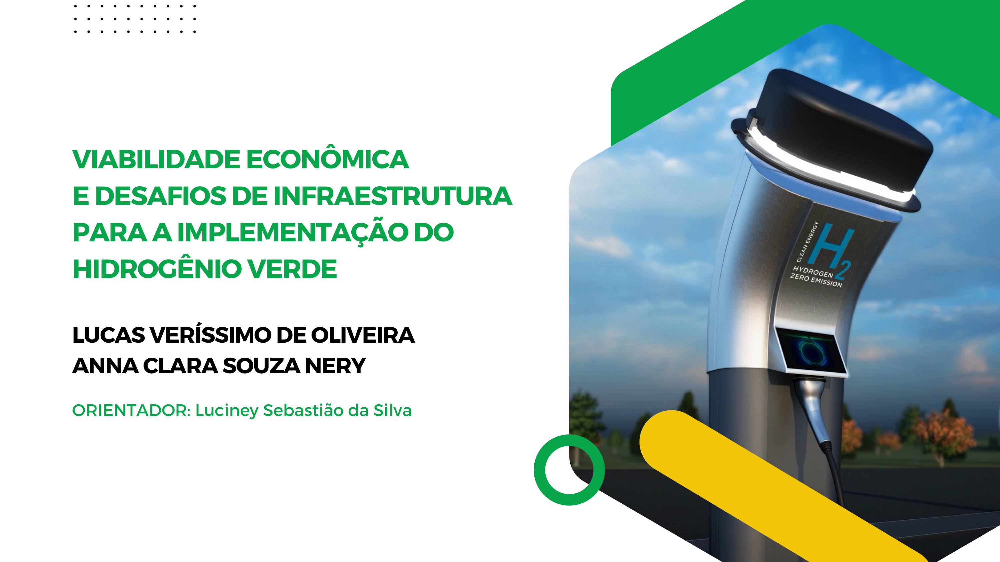 |
| **02** | 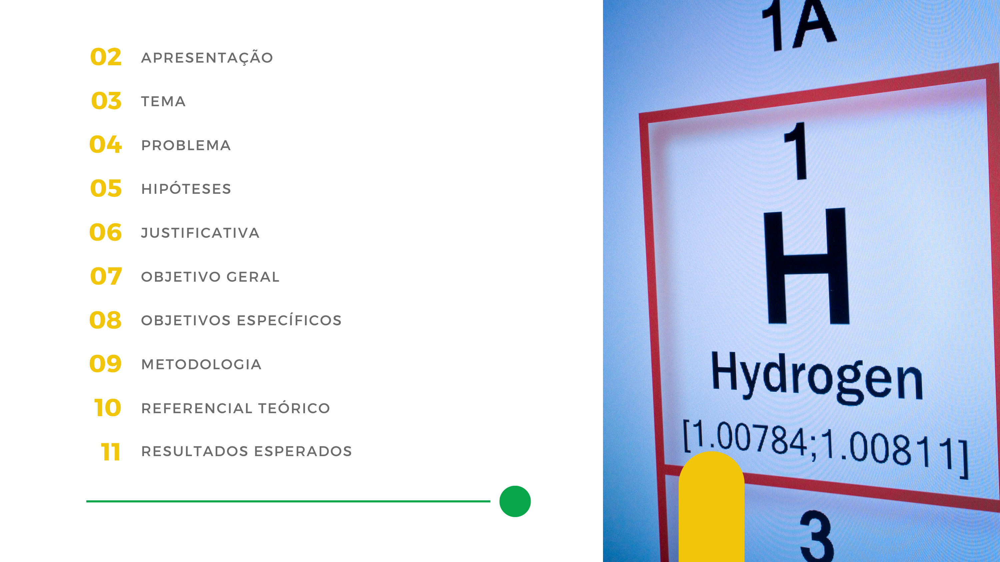 |
| **03** | 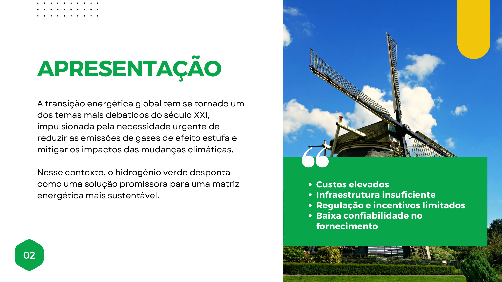 |
| **04** | 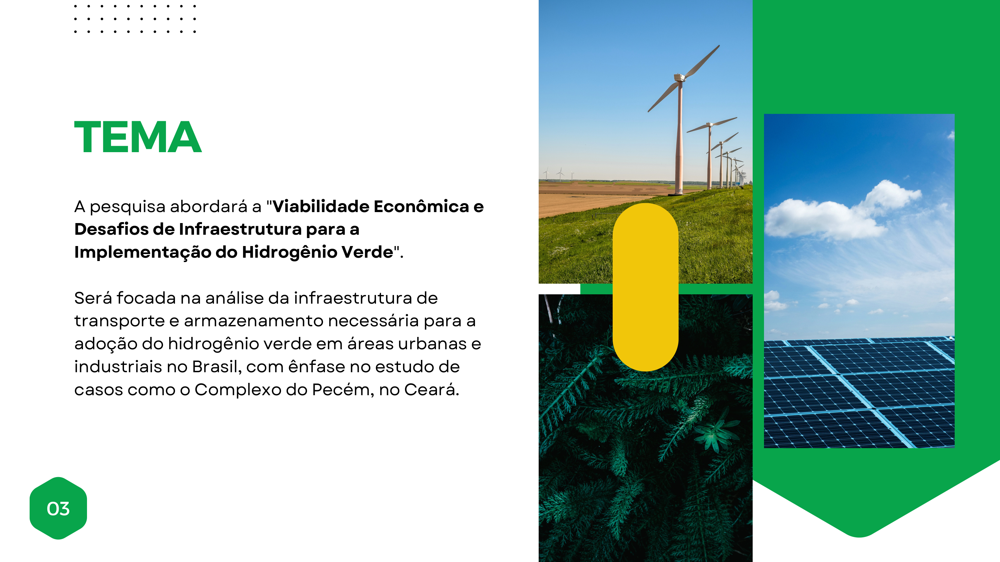 |
| **05** | 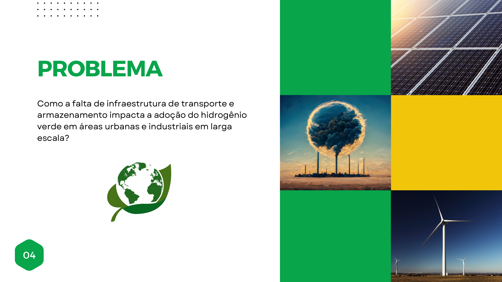 |
| **06** | 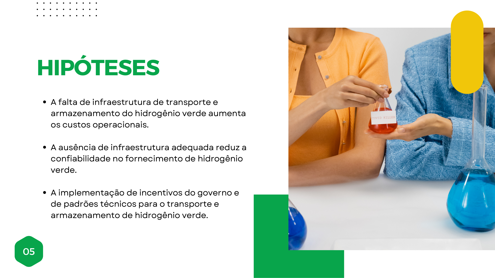 |
| **07** | 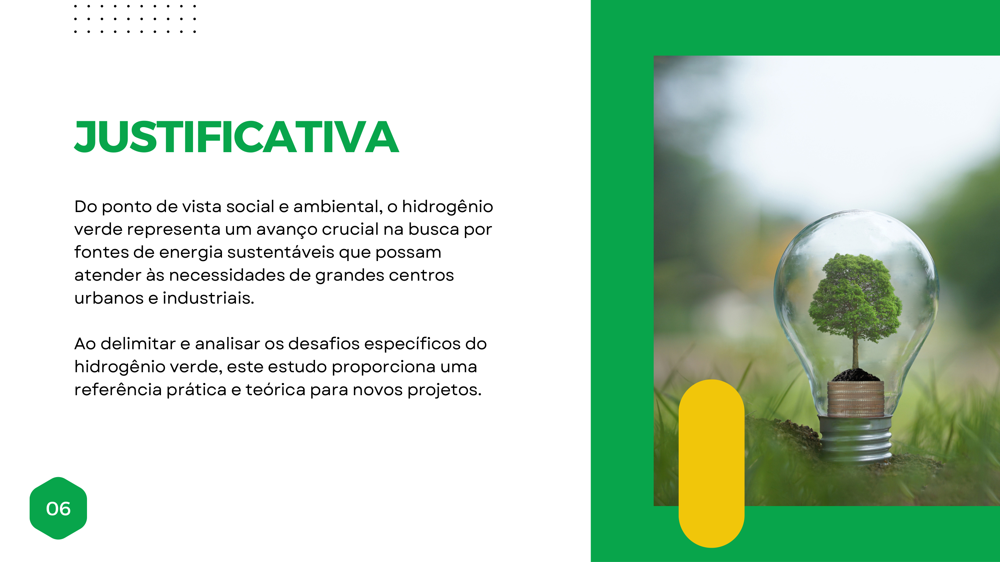 |
| **08** | 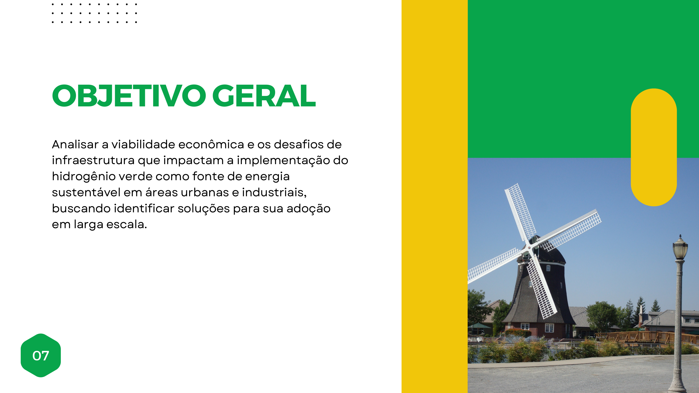 |
| **09** | 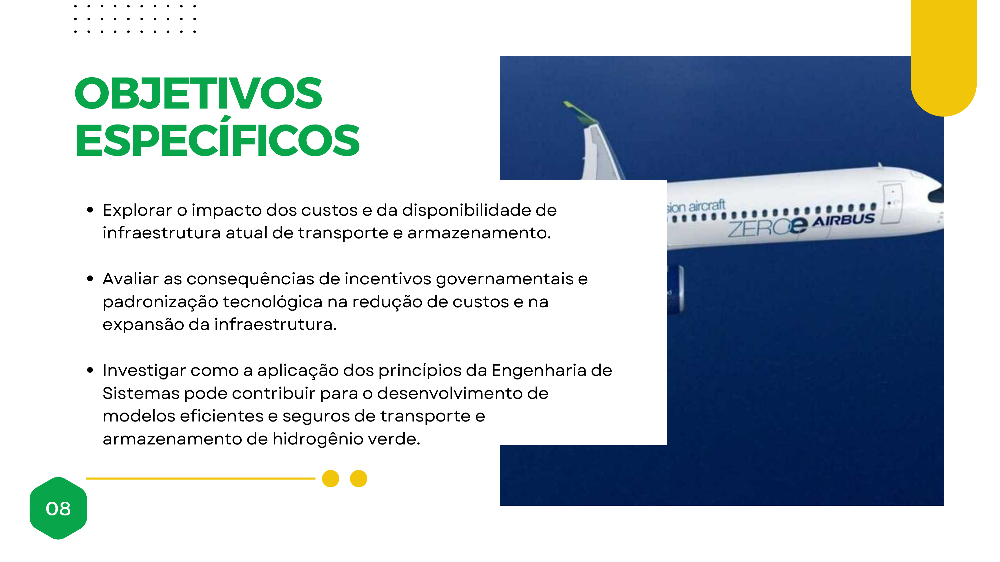 |
| **10** | 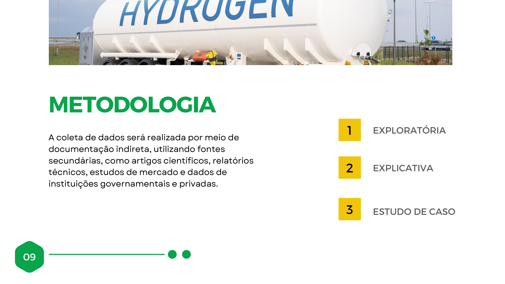 |
| **11** | 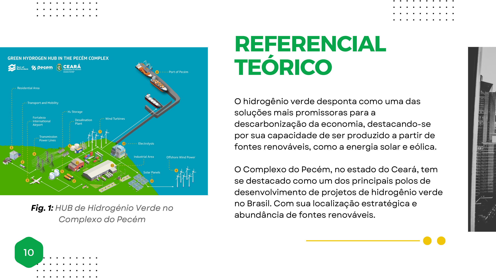 |
| **12** | 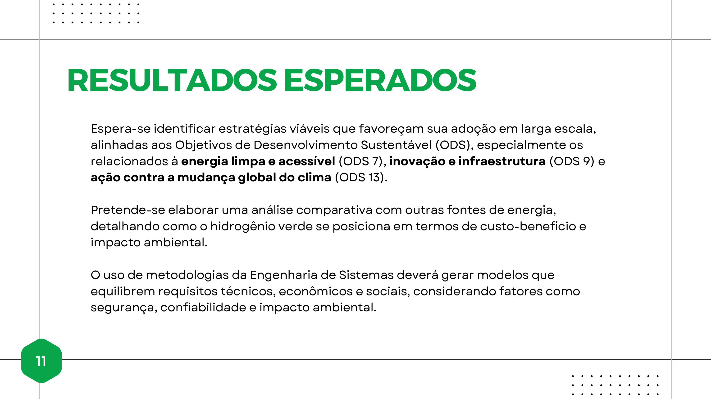 |
| **13** |  |

---

 

---

## Versão em Português

# Viabilidade Econômica e Desafios de Infraestrutura para a Implementação do Hidrogênio Verde

### Sobre o Projeto
Este projeto apresenta um estudo acadêmico sobre a **Viabilidade Econômica e Desafios de Infraestrutura para a Implementação do Hidrogênio Verde** no Brasil. O hidrogênio verde, produzido a partir de fontes renováveis como eólica e solar, desponta como uma das soluções mais promissoras para a descarbonização da economia mundial.

#### Autores
* **Lucas Veríssimo de Oliveira**
* **Anna Clara Souza Nery**
* **Orientador:** Luciney Sebastião da Silva

#### Principais Tópicos Abordados
1. **Apresentação:** A transição energética global e a necessidade de reduzir a emissão de gases de efeito estufa.
2. **Tema:** Análise da infraestrutura de transporte e armazenamento necessária para a adoção do hidrogênio verde em áreas urbanas e industriais, com ênfase no **Complexo do Pecém (Ceará)**.
3. **Problema:** Impactos da falta de infraestrutura de transporte e armazenamento no fornecimento em larga escala.
4. **Hipóteses:** Elevação dos custos operacionais, redução na confiabilidade do fornecimento e o papel das regulamentações/incentivos governamentais.
5. **Justificativa:** Importância socioambiental e alinhamento com os Objetivos de Desenvolvimento Sustentável (ODS 7, ODS 9 e ODS 13).
6. **Objetivos:** Avaliar viabilidade econômica, incentivos regulatórios e aplicar princípios da Engenharia de Sistemas para propor modelos seguros e eficientes.
7. **Metodologia:** Pesquisa exploratória, explicativa e estudo de caso fundamentados em dados secundários e relatórios técnicos.
8. **Resultados Esperados:** Modelos de equilíbrio técnico-econômico e análise comparativa de custo-benefício.

---

### Como Abrir e Visualizar o Projeto

#### 1. Arquivo PDF Original
O projeto completo pode ser visualizado diretamente no arquivo [`viabilidade_economica.pdf`](./viabilidade_economica.pdf) abrindo-o em qualquer leitor de PDF ou navegador web.

#### 2. Demonstração em Imagens (Slides)
Abaixo estão dispostas as imagens em alta resolução de todas as 13 páginas da apresentação:

| Slide | Demonstração |
| :---: | :--- |
| **01** |  |
| **02** |  |
| **03** |  |
| **04** |  |
| **05** |  |
| **06** |  |
| **07** |  |
| **08** |  |
| **09** |  |
| **10** |  |
| **11** |  |
| **12** |  |
| **13** |  |
